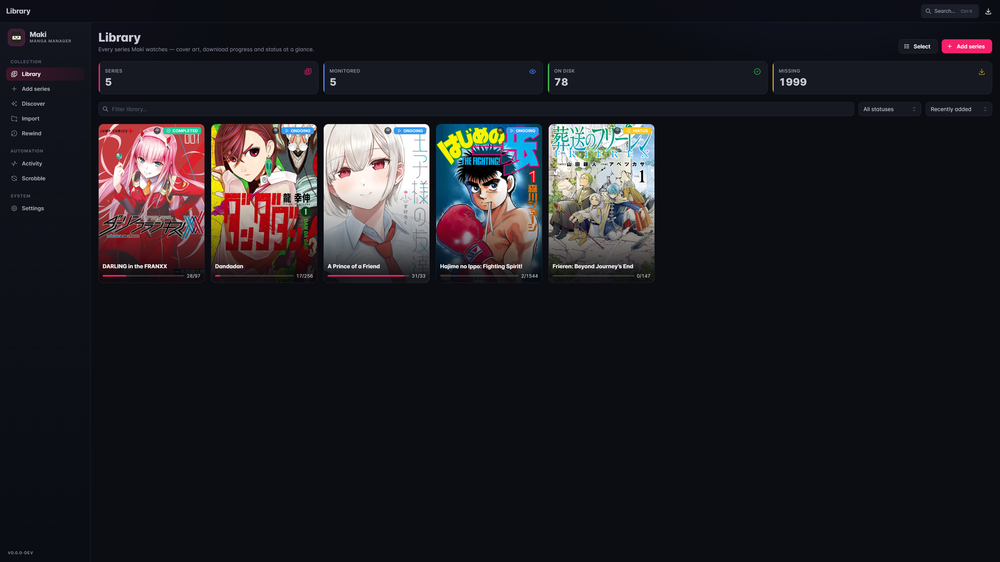
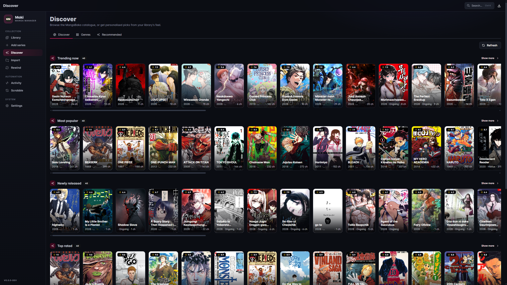
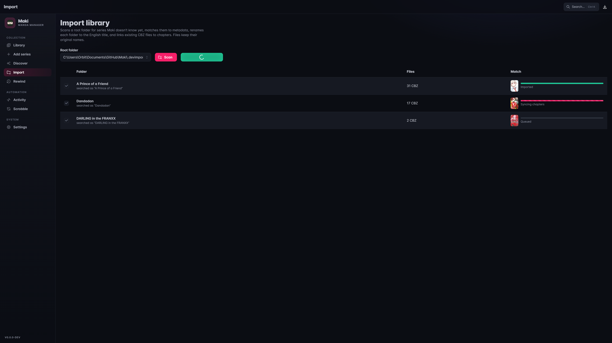
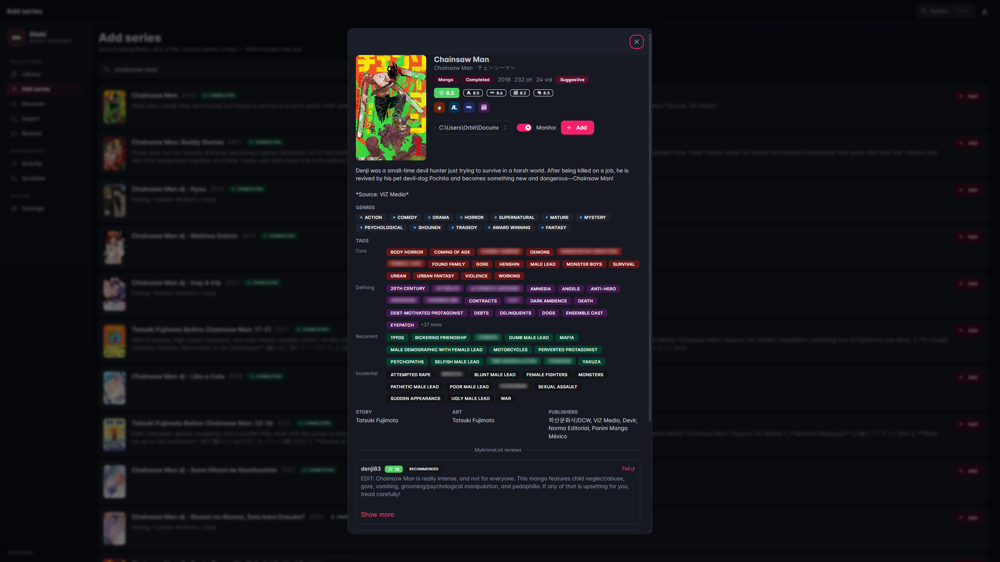
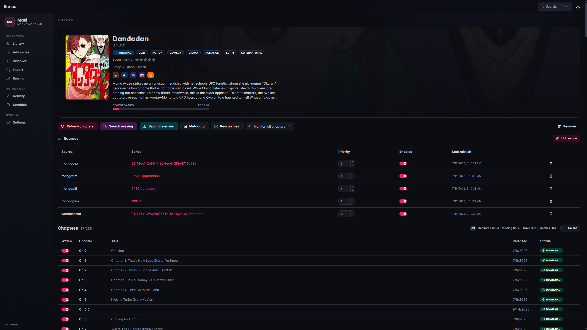
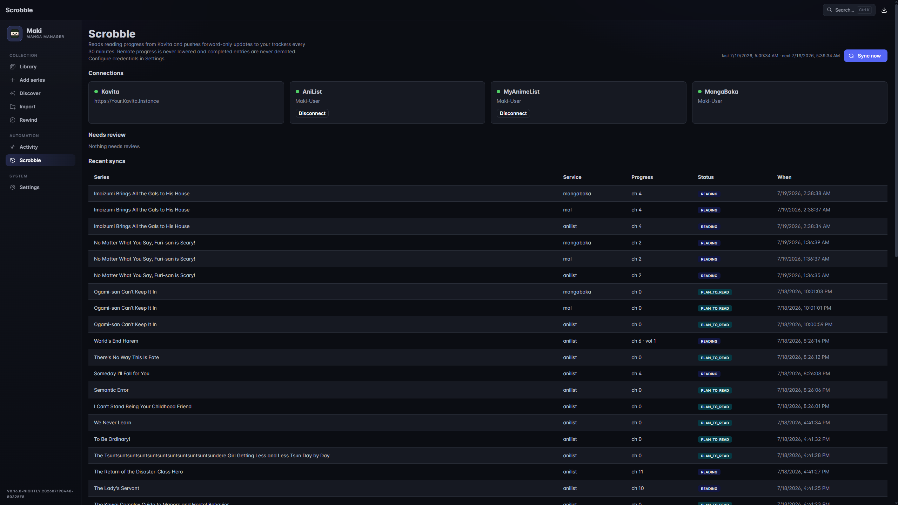
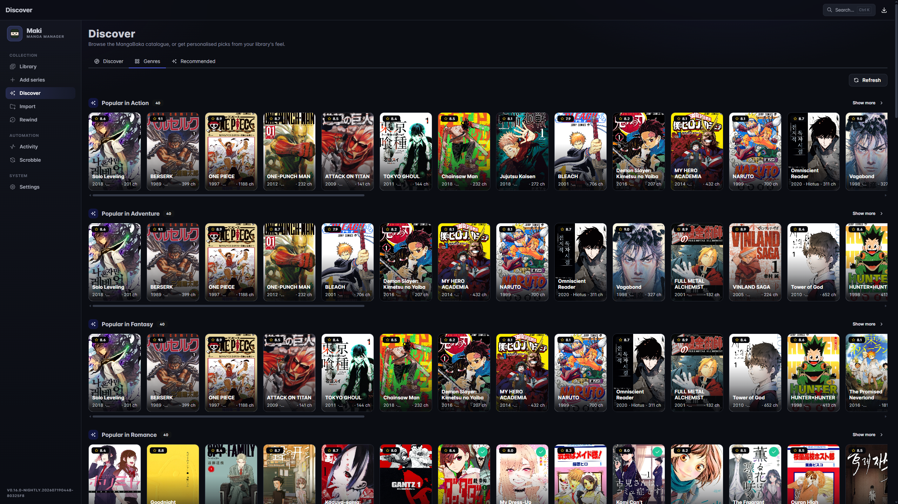
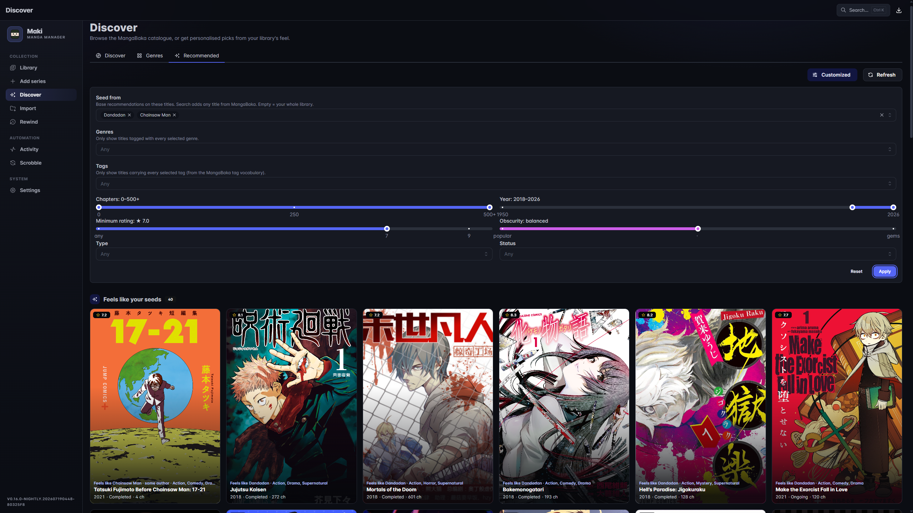
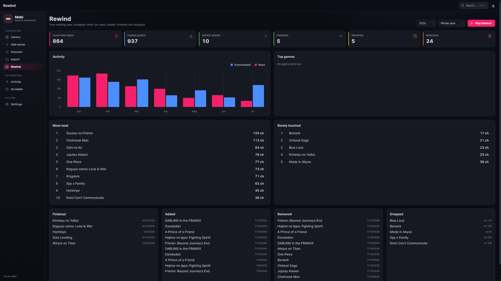

#  Maki

<!-- TODO: drop a logo/banner image here, e.g. docs/banner.png -->
<!--  -->

**Maki** is a manga collection manager in the spirit of [Sonarr](https://sonarr.tv)/[Radarr](https://radarr.video):
add a series once and Maki keeps it complete. It monitors sites for new chapters, downloads
pages, and packages everything as **CBZ files with ComicInfo.xml** that
[Kavita](https://www.kavitareader.com) parses natively.

[](https://github.com/OrbitMPGH/Maki/releases)
[](https://github.com/OrbitMPGH/Maki/actions/workflows/ci.yml)
[](LICENSE)

> Maki is almost entirely AI-slop-built, developed with Anthropic's latest Claude models.

<p float="left">
  
  
</p>

## Why Maki

- **You own the files.** Everything lands on disk as a standard CBZ + ComicInfo.xml. No
  proprietary database lock-in. Point any OPDS/CBZ-aware reader at the library folder.
- **Set-and-forget monitoring.** Add a series once; Maki polls sources for new chapters and
  downloads them automatically, the same workflow as Sonarr for TV or Radarr for movies.
- **Rich, free metadata.** A local mirror of the [MangaBaka](https://mangabaka.org) database
  means instant search and zero API rate limits, with cross-IDs into MyAnimeList / AniList /
  MangaUpdates / Kitsu.
- **Kavita-first, but not Kavita-only.** Output is a plain, well-tagged CBZ readable by any
  comic/manga reader. Kavita gets the extra integrations on top: cover push, scan triggers,
  reading-progress scrobbling.

## Features

- **Metadata from [MangaBaka](https://mangabaka.org).** One search identifies a series and
  brings along its MyAnimeList / AniList / MangaUpdates / Kitsu cross-IDs. Maki keeps a local
  copy of the [MangaBaka database](https://mangabaka.org/data/database) (nightly snapshot,
  ~3 GB on disk) so metadata search and library imports are instant and free of API rate
  limits; MangaBaka-original data is licensed
  [CC BY-NC-SA 4.0](https://creativecommons.org/licenses/by-nc-sa/4.0/).
- **Built-in site sources** (Suwayomi/Tachiyomi-style, compiled in):
  - **MangaDex** (official API)
  - **MangaPill**
  - **Weeb Central**
  - **MangaFire** (requires [FlareSolverr](https://github.com/FlareSolverr/FlareSolverr))
  - **MangaPlus** (official Shueisha)
  - **TCB Scans**
  - **Asura** (manhwa/manhua)
- **Automatic source matching** when you add a series, with manual linking for anything fuzzy.
- **Monitoring engine.** Refreshes chapter lists on a schedule and auto-downloads new chapters.
- **Kavita-friendly output.** `{Series}/{Series} Vol.X Ch.Y.cbz` naming, ComicInfo.xml with
  series/number/volume/authors/genres/language/reading-direction, atomic imports (no torn files).
- **Library at a glance.** Poster grid with per-series download state (Downloading / Queued /
  Complete / Missing), monitor status on every card, and a stats strip (series, monitored, on
  disk, missing, in queue).
- **Live activity queue** over SignalR, with retry/remove and per-page progress.
- **Torrent acquisition.** Search releases via Prowlarr, grab to qBittorrent, auto-import on
  completion. Runs alongside direct scraper downloads in the same queue.
- **Scrobbling.** Pushes read progress to **AniList**, **MyAnimeList** and **MangaBaka**, driven
  by reading progress read back from Kavita.
- **Discover.** Local ONNX embeddings over the MangaBaka dump surface titles that match your
  library's *feel*, not just shared genre labels. Seed from specific titles or browse curated
  per-genre rails on the Genres tab, and filter by year, rating, type, status, genre, chapter
  count and an obscurity dial. Every rail has a fullscreen "Show more" view with the same
  filters and up to 120 results. Each detail card shows categorized tags, per-source ratings
  and a few MyAnimeList reviews.
- **Rewind stats.** An append-only reading/download history (per-series read counts, activity
  over time) built from Kavita read progress and download events.
- **Backup & restore.** One-click zip snapshot of the database and settings, with an automatic
  safety backup before every schema migration.
- **Themes.** Pick an accent (Indigo / Rose / Emerald / Amber) or a light theme under Settings.
- REST API (`/api/v1`, `X-Api-Key` auth) + Swagger at `/swagger`.

## Screenshots

### Import



### Add Series



### Series page



### Scrobble



### Discover




### Recommendation engine



### Rewind



## Quick start (Docker)

```yaml
services:
  maki:
    image: ghcr.io/orbitmpgh/maki:latest
    container_name: maki
    environment:
      - PUID=1000
      - PGID=1000
    volumes:
      - ./maki-config:/config
      - /path/to/manga-library:/library
    ports:
      - "8990:8990"
    restart: unless-stopped

  kavita:
    image: jvmilazz0/kavita:latest
    container_name: kavita
    volumes:
      - ./kavita-config:/kavita/config
      - /path/to/manga-library:/library   # same library!
    ports:
      - "5000:5000"
    restart: unless-stopped

  # Optional, only needed for Cloudflare-protected sources (MangaFire)
  flaresolverr:
    image: ghcr.io/flaresolverr/flaresolverr:latest
    container_name: flaresolverr
    ports:
      - "8191:8191"
    restart: unless-stopped
```

1. Open `http://localhost:8990`, go to **Settings** and add `/library` as a root folder.
2. (Optional) Set the FlareSolverr URL to `http://flaresolverr:8191` and hit **Test**.
3. **Add Series** → search → pick → Maki auto-links sources and syncs chapters.
4. Click the download button on a chapter (or **Search all missing**) and watch **Activity**.
5. Point a Kavita library at the same folder. The CBZs parse with full metadata.

The API key is generated on first run into `/config/config.json` and shown in Settings.

### Settings you'll want to visit

- **Root folders.** Where CBZs are written (point Kavita at the same paths).
- **Metadata.** Download the local MangaBaka dump (~3 GB) for instant, rate-limit-free search.
- **Discover index.** Build the ONNX embedding index that powers recommendations.
- **Prowlarr / qBittorrent.** Optional torrent acquisition.
- **Kavita.** Optional scan triggers, cover/metadata push, and reading-progress scrobbling.
- **Scrobbling.** Connect AniList / MyAnimeList / MangaBaka.
- **Appearance.** Accent colour and light/dark theme.
- **Backup & Restore.** Snapshot your database + `config.json` to a zip (see below).

## Backup & restore

Settings → **Backup & Restore** manages zip backups of your library. Each backup holds a
consistent snapshot of the database plus `config.json`, everything that isn't cheap to
regenerate. The MangaBaka dump, embeddings, covers and cache are deliberately excluded, so
backups stay small. Backups live under `{ConfigDir}/backups`; keep the newest N per kind with
the retention setting.

Maki also takes an automatic backup **immediately before any upgrade applies a database
migration**. Migrations are forward-only, so this is your recovery path if an upgrade goes
wrong.

> **Backups contain your settings secrets (API keys, passwords) in plain text.** Treat a
> downloaded backup like a password.

**Restoring** replaces the current database and settings, then restarts Maki to apply. Under
Docker (`restart: unless-stopped`) or systemd the app comes back automatically; a bare
`dotnet run`/exe just exits and you start it again. You can also upload a backup zip from another
machine. Maki refuses one that's newer than the running version (its schema can't be
downgraded).

## Building the Docker image

The repository ships a multi-stage [`Dockerfile`](Dockerfile) that builds the frontend
(Node 22) and backend (.NET 10 SDK) and packages them into an `aspnet:10.0` runtime image with
the built SPA served from `wwwroot/`. Build and run it yourself:

```bash
# Build (tag however you like)
docker build -t maki:local .

# Run
docker run -d --name maki \
  -p 8990:8990 \
  -v "$PWD/maki-config:/config" \
  -v "/path/to/manga-library:/library" \
  maki:local
```

Multi-arch build & push to a registry with Buildx:

```bash
docker buildx build \
  --platform linux/amd64,linux/arm64 \
  -t ghcr.io/<you>/maki:latest \
  --push .
```

Notes:
- The build context is the repo root; `.dockerignore` keeps `bin/`, `obj/`, `node_modules/`,
  `dist/` and dev config out of the context.
- `entrypoint.sh` drops privileges to `PUID`/`PGID` (via `gosu`) after fixing ownership of
  `/config`, so files land with your user's ownership.
- State persists in the `/config` volume; the library is a separate mount you share with Kavita.
- An identical Dockerfile lives at `distribution/docker/Dockerfile` for CI.

## Development

```bash
# Backend (http://localhost:8990, Swagger at /swagger)
dotnet run --project src/Maki.Api

# Frontend dev server (http://localhost:5173, proxies /api + /signalr)
npm --prefix frontend run dev

# Tests
dotnet test

# Release build (what the container ships)
dotnet build -c Release
```

State lives in `MAKI_CONFIG_DIR` (defaults to `/config` in Docker, `%APPDATA%\Maki`
on Windows). SQLite database, logs, covers, page cache, and the MangaBaka dump all live there.
For local development, point it at a throwaway dir so you don't touch your real library/DB:

```bash
MAKI_CONFIG_DIR="$PWD/.devconfig" dotnet run --project src/Maki.Api
```

EF Core migrations apply automatically on startup, no manual step.

## Architecture

```
src/
├── Maki.Api/        ASP.NET Core host, REST /api/v1, SignalR, Quartz jobs, download workers
├── Maki.Core/       Domain: entities, ISource/IMetadataProvider, parser, naming, CBZ pipeline
├── Maki.Data/       EF Core + SQLite
├── Maki.Sources/    Site scrapers (MangaDex, MangaPill, WeebCentral, MangaFire, MangaPlus,
│                    TCB Scans, Asura)
└── Maki.Metadata/   MangaBaka provider + local dump + ONNX embeddings
frontend/               Vite + React + TypeScript + Mantine SPA
```

Sources implement a single `ISource` interface (search / series / chapters / pages) and are
registered in DI. Adding a site is one class plus one registration. Page requests carry their
own headers (Referer, cookies) end-to-end so hotlink-protected CDNs work uniformly.

## Project status

Maki is pre-1.0 (see [`Directory.Build.props`](Directory.Build.props) for the current version)
and under active development. Schema and API can still shift between releases. See
[TODO.md](TODO.md) for the roadmap, including the gates before a 1.0.0 release.

Issues and pull requests are welcome.

## Legal

Maki is a tool for organizing your library. Scraper sources access third-party websites.
You are responsible for complying with those sites' terms of service and your local laws.
Support the industry: buy official releases.

## License

[GPL-3.0](LICENSE)
