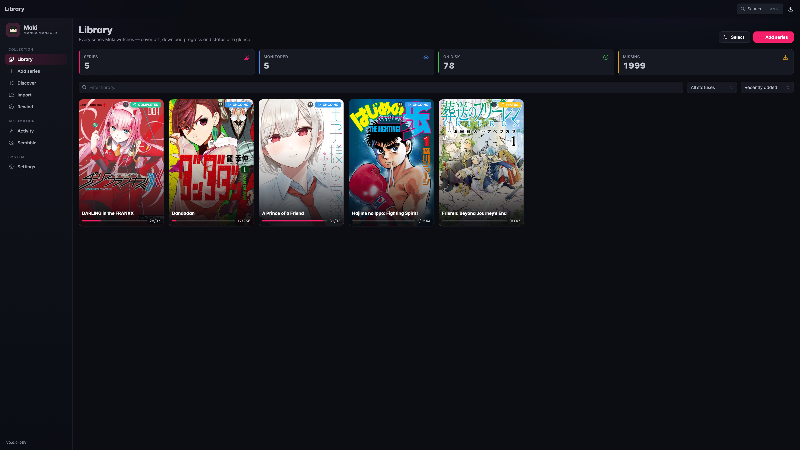
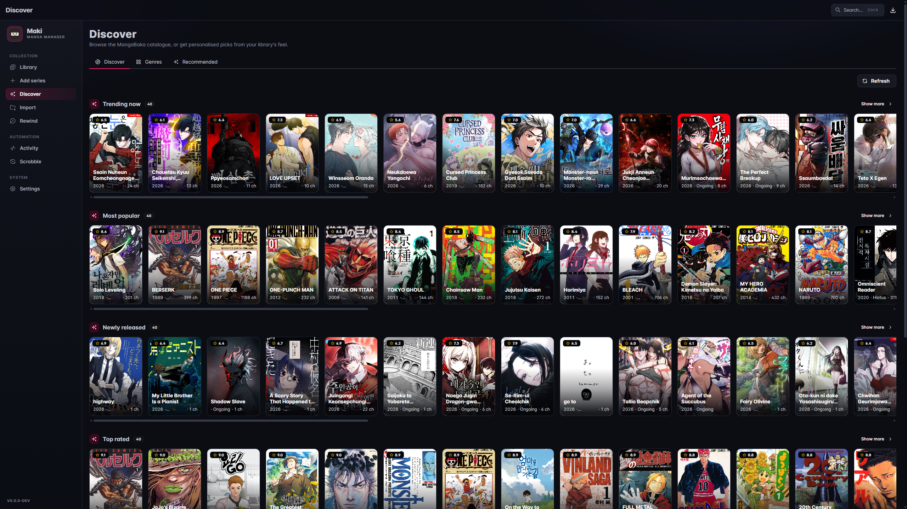
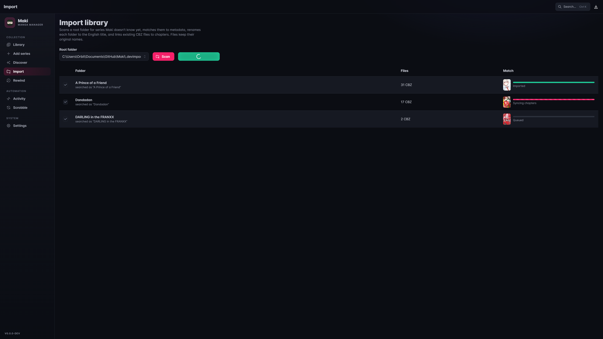
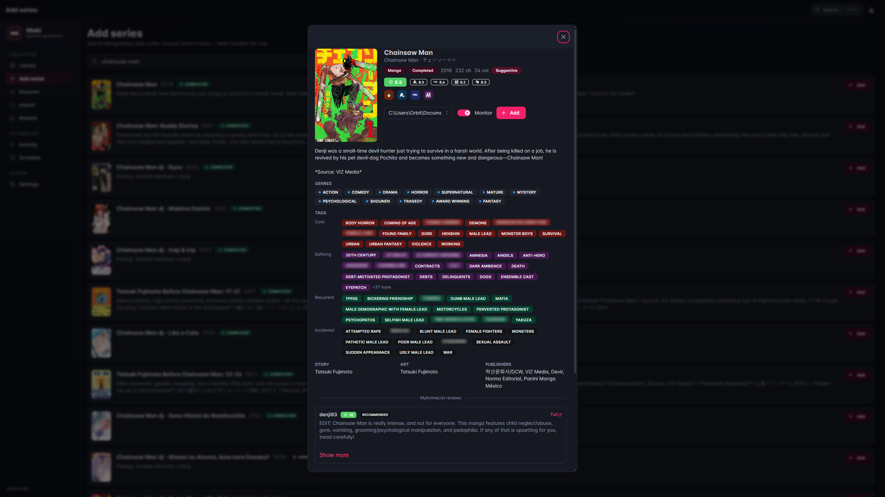
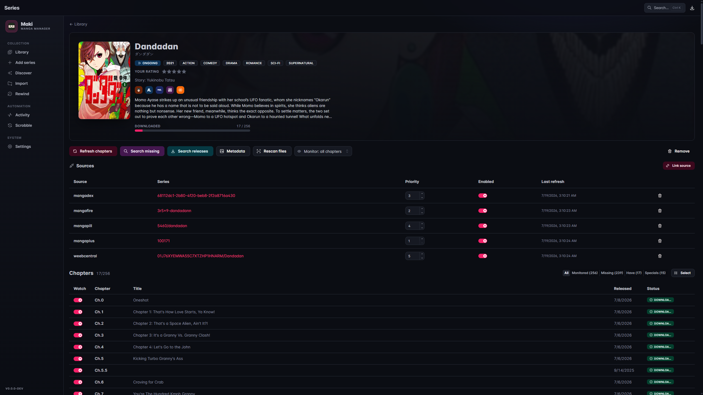
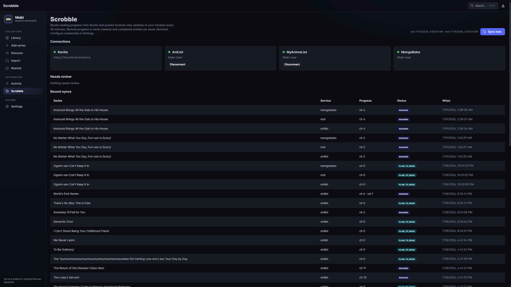
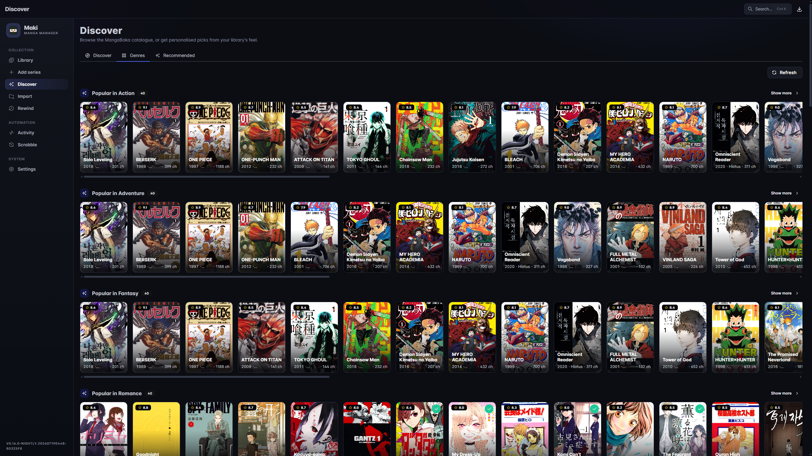
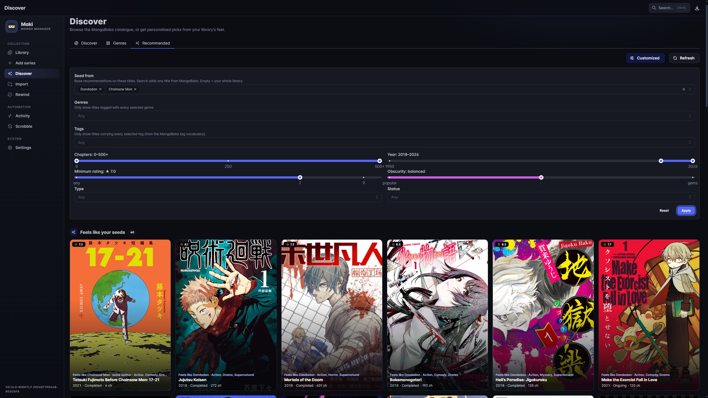
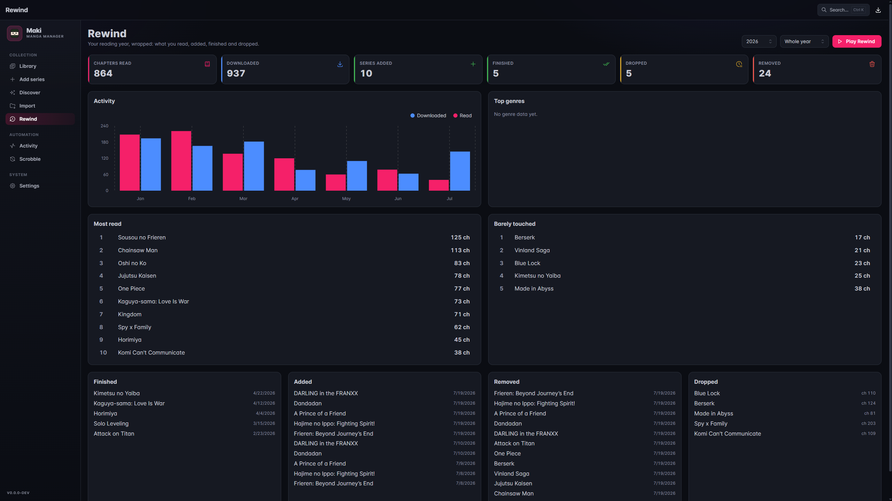

#  Maki

<!-- TODO: drop a logo/banner image here, e.g. docs/banner.png -->
<!--  -->

**Maki** is a manga collection manager in the spirit of [Sonarr](https://sonarr.tv)/[Radarr](https://radarr.video):
add a series once and Maki keeps it complete. It monitors sites for new chapters, downloads
pages, and packages everything as **CBZ files with ComicInfo.xml** that
[Kavita](https://www.kavitareader.com) parses natively — or read them straight in Maki's own
built-in reader.

[](https://github.com/OrbitMPGH/Maki/releases)
[](https://github.com/OrbitMPGH/Maki/actions/workflows/ci.yml)
[](LICENSE)

> Maki is almost entirely AI-slop-built, developed with Anthropic's latest Claude models.

<p float="left">
  
  
</p>

## Why Maki

- **You own the files.** Everything lands on disk as a standard CBZ + ComicInfo.xml. No
  proprietary database lock-in. Point any OPDS/CBZ-aware reader at the library folder.
- **Set-and-forget monitoring.** Add a series once; Maki polls sources for new chapters and
  downloads them automatically, the same workflow as Sonarr for TV or Radarr for movies.
- **Rich, free metadata.** A local mirror of the [MangaBaka](https://mangabaka.org) database
  means instant search and zero API rate limits, with cross-IDs into MyAnimeList / AniList /
  MangaUpdates / Kitsu.
- **Kavita-friendly, but not Kavita-required.** Output is a plain, well-tagged CBZ readable by
  any comic/manga reader. Read straight in Maki's built-in reader or over OPDS, or point Kavita
  at the same folder for cover push, scan triggers, and reading-progress scrobbling.

## Features

- **Metadata from [MangaBaka](https://mangabaka.org).** One search identifies a series and
  brings along its MyAnimeList / AniList / MangaUpdates / Kitsu cross-IDs. Maki keeps a local
  copy of the [MangaBaka database](https://mangabaka.org/data/database) (nightly snapshot,
  ~3 GB on disk) so metadata search and library imports are instant and free of API rate
  limits; MangaBaka-original data is licensed
  [CC BY-NC-SA 4.0](https://creativecommons.org/licenses/by-nc-sa/4.0/).
- **Built-in site sources** (Suwayomi/Tachiyomi-style, compiled in):
  - **MangaDex** (official API)
  - **MangaPill**
  - **Weeb Central**
  - **MangaFire** (requires [FlareSolverr](https://github.com/FlareSolverr/FlareSolverr))
  - **MangaPlus** (official Shueisha)
  - **TCB Scans**
  - **Asura** (manhwa/manhua)
  - **WEBTOON** (official webtoons.com, English — ORIGINALS and CANVAS)
  - **Flame Comics** (manhwa/manhua)
  - **TopManhua** (manhwa/manhua)
- **Automatic source matching** when you add a series, with manual linking for anything fuzzy.
  Sources are drag-ordered by preference and can be switched off globally — a disabled source is
  skipped by auto-matching and stops every series from using it, while each series' own per-source
  toggle is kept untouched and applies again the moment you turn it back on. Adding a series returns
  instantly; matching itself runs in the background and can be re-run any time.
- **Monitoring engine.** Refreshes chapter lists on a schedule and auto-downloads new chapters,
  with smart auto-queue for newly-monitored series.
- **Kavita-friendly output.** `{Series}/{Series} Vol.X Ch.Y.cbz` naming, ComicInfo.xml with
  series/number/volume/authors/genres/language/reading-direction, atomic imports (no torn files).
- **Built-in reader.** Read pages directly in Maki (paged, double-page, 1:1 scale, or continuous
  scroll-to-advance), with progress tracked and merged with Kavita so nothing double-counts. A
  toolbar read meter shows how far through the series you are. Per-user reading profiles apply
  fit/direction/mode defaults by series type, with per-series overrides on top. A Home screen
  surfaces Continue Reading, Recently Added and other rails, drag-reorderable and switchable per
  user.
- **Library at a glance.** Grid or list view (with density options), per-series download state
  (Downloading / Queued / Complete / Missing), read badges, monitor status on every card, a
  stats strip (series, monitored, on disk, missing, in queue), user tags, saved filters, and
  bulk chapter monitoring via click-based table selection. Per-series incognito mode keeps a
  title out of stats and progress without hiding it from the library.
- **Live activity queue** over SignalR, with retry/remove and per-page progress.
- **Torrent acquisition.** Search releases via Prowlarr, grab to qBittorrent, auto-import on
  completion. Runs alongside direct scraper downloads in the same queue.
- **Scrobbling.** Pushes read progress to **AniList**, **MyAnimeList**, **Kitsu** and **MangaBaka**, driven
  by reading progress from Kavita or Maki's own reader.
- **Discover.** Local ONNX embeddings over the MangaBaka dump surface titles that match your
  library's *feel*, not just shared genre labels. Seed from specific titles or browse curated
  per-genre rails on the Genres tab, and filter by year, rating, type, status, genre, chapter
  count and an obscurity dial. Recommendations sample multiple representative seeds per title
  rather than one centroid, with a diversity slider to trade relevance for variety. Every rail
  has a fullscreen "Show more" view with the same filters and up to 120 results. Each detail
  card shows categorized tags, alternate titles, per-source ratings and a few MyAnimeList
  reviews.
- **OPDS server.** Serves the library as an OPDS 1.2 catalogue with page streaming (OPDS-PSE),
  so Panels, Chunky, KOReader and the Mihon/Tachiyomi OPDS extensions read straight from Maki
  with no Kavita hop. Off by default; the feed URL carries its own rotatable token, and pages
  streamed by a reader count as read in your library, Rewind and your trackers.
- **Stats.** Overview and Library tabs built from an append-only reading/download history
  (per-series read counts, activity over time), plus a Progress track: levels, streaks,
  achievements and reading-time tracking, split into a Reader track (yours) and a Library track
  (the instance's). Series marked incognito never generate events.
- **Backup & restore.** One-click zip snapshot of the database and settings, with an automatic
  safety backup before every schema migration.
- **Themes.** Pick an accent (Indigo / Rose / Emerald / Amber) or a light theme under Settings.
- REST API (`/api/v1`, `X-Api-Key` auth, rotatable from Settings) + Swagger at `/swagger`.

## Quick start (Docker)

```yaml
services:
  maki:
    image: ghcr.io/orbitmpgh/maki:latest
    container_name: maki
    environment:
      - PUID=1000
      - PGID=1000
    volumes:
      - ./maki-config:/config
      - /path/to/manga-library:/library
    ports:
      - "8990:8990"
    restart: unless-stopped

  kavita:
    image: jvmilazz0/kavita:latest
    container_name: kavita
    volumes:
      - ./kavita-config:/kavita/config
      - /path/to/manga-library:/library   # same library!
    ports:
      - "5000:5000"
    restart: unless-stopped

  # Optional, only needed for Cloudflare-protected sources (MangaFire)
  flaresolverr:
    image: ghcr.io/flaresolverr/flaresolverr:latest
    container_name: flaresolverr
    ports:
      - "8191:8191"
    restart: unless-stopped
```

1. Open `http://localhost:8990` and create the administrator account when prompted.
2. Go to **Settings** and add `/library` as a root folder.
3. (Optional) Set the FlareSolverr URL to `http://flaresolverr:8191` and hit **Test**.
4. **Add Series** → search → pick → Maki auto-links sources and syncs chapters.
5. Click the download button on a chapter (or **Search all missing**) and watch **Activity**.
6. Point a Kavita library at the same folder. The CBZs parse with full metadata.

Upgrading from a single-user Maki? The first page you see asks you to set a username and password. Your
library, reading history and tracker connections are already attached to that account — nothing is
migrated and nothing is lost.

### Settings you'll want to visit

- **My account.** Your password, two-factor authentication, API keys, and signing other devices out.
- **Users.** Create accounts and choose what each may do — add series, download chapters, manage tags,
  connect their own trackers — plus a per-account maximum content rating.
- **Security.** HTTPS enforcement, trusted proxies, lockout thresholds, session lifetime.
- **Root folders.** Where CBZs are written (point Kavita at the same paths).
- **Metadata.** Download the local MangaBaka dump (~3 GB) for instant, rate-limit-free search.
- **Discover index.** Build the ONNX embedding index that powers recommendations.
- **Reader.** Paged / double-page / continuous-scroll modes, reading direction, fit mode, and
  whether progress pushes back to Kavita.
- **Home.** Turn Home on/off, pick it as the start page, and reorder or hide its rails.
- **Prowlarr / qBittorrent.** Optional torrent acquisition.
- **Kavita.** Optional scan triggers, cover/metadata push, and reading-progress scrobbling.
- **OPDS.** Off by default. Switch it on to get a token-carrying feed URL for external readers.
- **Scrobbling.** Connect AniList / MyAnimeList / Kitsu / MangaBaka.
- **Appearance.** Accent colour and light/dark theme.
- **Backup & Restore.** Snapshot your database + `config.json` to a zip (see below).

## Multiple readers

Each account gets its own reading history, preferences and tracker connections. The library itself is
shared — one copy of the files, one set of series and chapters — so a second reader costs no disk.

Per user: read/unread state and resume position, bookmarks, series ratings, per-series reader
overrides, saved Library filters, reader defaults, start page and Home layout, the content-rating
ceiling, the OPDS catalogue and its feed URL, and the AniList / MyAnimeList / Kitsu / MangaBaka
accounts progress is pushed to. Ratings go to *your* tracker profile, not the instance owner's.

Shared, and admin-only to change: root folders, download clients and indexers, sources and their
priority, metadata and recommendation settings, notifications, backups, and the tracker app
registrations (client id and secret — the account each person connects with is their own).

**Library access** is granted per root folder under Settings → Users. An account with no grants sees an
empty library rather than the whole one: access is given, never assumed. Series, chapters, covers,
search and OPDS all respect it.

**Kavita is a special case.** It is one server reached with one API key, so everything it reports is a
single person's reading — there is no way to tell two Kavita users apart from Maki's side. Settings →
Kavita reading picks which Maki account it belongs to (unset means the first admin). Only that account
can import read status from Kavita or push its reads back; for everyone else the toggle is disabled and
says so.

## Exposing Maki to the internet

Maki authenticates with an HttpOnly session cookie and per-user API keys. Before putting it on a public
address, do these four things:

1. **Terminate TLS in front of it**, then turn on **Settings → Security → Require HTTPS**. That marks
   the session cookie `Secure` and enables HSTS. Don't enable it before TLS is actually working — a
   `Secure` cookie sent over plain HTTP is never returned, so sign-in fails with nothing to explain it.
2. **List your reverse proxy under Trusted proxies** (an IP or CIDR, e.g. `172.18.0.0/16`). Until you
   do, `X-Forwarded-For` is ignored entirely — honouring it from anyone would let a client claim any
   address and so forge the audit log and slip past rate limiting and account lockout. The symptom of
   forgetting is every failed sign-in being attributed to the proxy.
3. **Turn on two-factor authentication** under Settings → My account.
4. **Give each reader their own account** rather than sharing one, and grant only what they need. A new
   account starts with OPDS and tracker access, no root folders and no admin — see
   [Multiple readers](#multiple-readers). If you already run an identity provider, point Maki at it
   instead of handing out passwords: [Single sign-on](#single-sign-on-openid-connect).

Security settings are applied at startup, so **restart Maki after changing them**.

Two directories under `/config` are credential material and belong under the same filesystem
permissions as the database: `dataprotection-keys` (whoever holds it can mint a session cookie for any
user) and `backups`. Backups deliberately exclude the key ring, which is also why restoring onto a
different machine signs everyone out once.

API keys and OPDS feed URLs are shown **exactly once**, when created — only a SHA-256 fingerprint is
stored, so a lost key is replaced rather than recovered.

## Single sign-on (OpenID Connect)

Optional, and it sits alongside local passwords rather than replacing them. Tested against Authelia,
Keycloak, Authentik and Entra ID; anything that speaks OpenID Connect discovery and the authorization
code flow should work.

Register Maki with your provider as a **confidential or public client** using the authorization code
flow with PKCE, and set its redirect URI to `https://maki.example.com/api/v1/auth/oidc/callback` —
your own host, with that path. Then fill in Settings → Single sign-on:

| Field | Notes |
|---|---|
| Issuer URL | e.g. `https://auth.example.com`. Maki appends `/.well-known/openid-configuration` itself. |
| Client ID / secret | Leave the secret empty for a public client; PKCE protects the exchange either way. |
| Scopes | `openid` is always requested. Add `groups` (or whatever your provider calls it) if you want claim mapping. |
| Create accounts on first sign-in | Off by default. On, anyone your provider authenticates gets an account — right for a household realm, wrong for a shared company one. |
| Admin claim / Permission claim | Optional. See below. |

**Restart Maki after saving** — the provider's configuration is read once at startup.

A new account created this way starts with **no library access**: grant it a root folder under
Settings → Users, the same as any other account.

**Linking existing accounts.** An account is identified by the provider's `sub` claim, so renaming a
user upstream doesn't strand them. The first time an unrecognised subject signs in, Maki links it to an
existing local account with the same email — but only if the provider says the address is verified and
exactly one account has it. Otherwise it either creates an account (if you allowed that) or refuses.

**Claim mapping is optional and all-or-nothing.** Leave both claim fields empty and your provider only
says *who* somebody is; permissions stay whatever the Users page says. Fill either one in and the
provider becomes the authority: permissions are recomputed on every sign-in, so removing someone from a
group takes their access away here too — and edits made on the Users page are overwritten. Write the
admin claim as `claim=value` (`groups=maki-admins`); the permission claim is just a claim name, whose
values are matched against permission names (`DownloadChapters`, `UseOpds`, …). Values matching nothing
are ignored, and `Admin` is only ever granted through the admin claim.

**Requiring single sign-on, and getting back in.** "Require single sign-on" refuses password sign-in
for everyone **except administrators** — an outage at your provider should never cost you your own
library. If you are locked out anyway (a rotated client secret, a provider that has stopped answering),
set `MAKI_ALLOW_LOCAL_LOGIN=1` in Maki's environment and restart: password sign-in comes back for every
account, and Maki logs a warning at startup and shows a banner on the settings card until you remove it.

```yaml
services:
  maki:
    environment:
      - MAKI_ALLOW_LOCAL_LOGIN=1   # temporary: restores password sign-in
```

An `http://` issuer is allowed, for a provider on the same LAN or Docker network, and Maki warns at
startup when you use one. The identity tokens are signed either way, but the discovery document and
signing keys travel in the clear, so whoever can rewrite those chooses the key that signs your users'
identities. Prefer `https://` if the provider can offer it.

## Screenshots

### Import



### Add Series



### Series page



### Scrobble



### Discover




### Recommendation engine



### Rewind



## Backup & restore

Settings → **Backup & Restore** manages zip backups of your library. Each backup holds a
consistent snapshot of the database plus `config.json`, everything that isn't cheap to
regenerate. The MangaBaka dump, embeddings, covers and cache are deliberately excluded, so
backups stay small. Backups live under `{ConfigDir}/backups`; keep the newest N per kind with
the retention setting.

Maki also takes an automatic backup **immediately before any upgrade applies a database
migration**. Migrations are forward-only, so this is your recovery path if an upgrade goes
wrong.

> **Backups contain your settings secrets (API keys, passwords) in plain text.** Treat a
> downloaded backup like a password.

**Restoring** replaces the current database and settings, then restarts Maki to apply. Under
Docker (`restart: unless-stopped`) or systemd the app comes back automatically; a bare
`dotnet run`/exe just exits and you start it again. You can also upload a backup zip from another
machine. Maki refuses one that's newer than the running version (its schema can't be
downgraded).

## Building the Docker image

The repository ships a multi-stage [`Dockerfile`](Dockerfile) that builds the frontend
(Node 22) and backend (.NET 10 SDK) and packages them into an `aspnet:10.0` runtime image with
the built SPA served from `wwwroot/`. Build and run it yourself:

```bash
# Build (tag however you like)
docker build -t maki:local .

# Run
docker run -d --name maki \
  -p 8990:8990 \
  -v "$PWD/maki-config:/config" \
  -v "/path/to/manga-library:/library" \
  maki:local
```

Multi-arch build & push to a registry with Buildx:

```bash
docker buildx build \
  --platform linux/amd64,linux/arm64 \
  -t ghcr.io/<you>/maki:latest \
  --push .
```

Notes:
- The build context is the repo root; `.dockerignore` keeps `bin/`, `obj/`, `node_modules/`,
  `dist/` and dev config out of the context.
- `entrypoint.sh` drops privileges to `PUID`/`PGID` (via `gosu`) after fixing ownership of
  `/config`, so files land with your user's ownership.
- State persists in the `/config` volume; the library is a separate mount you share with Kavita.
- An identical Dockerfile lives at `distribution/docker/Dockerfile` for CI.

## Development

```bash
# Backend (http://localhost:8990). Swagger is at /swagger in Development only — it documents every
# endpoint including the one that replaces the database, and it is not behind the API prefix, so it
# is not mapped at all in a release build.
dotnet run --project src/Maki.Api

# Frontend dev server (http://localhost:5173, proxies /api + /signalr)
npm --prefix frontend run dev

# Tests
dotnet test

# Release build (what the container ships)
dotnet build -c Release
```

State lives in `MAKI_CONFIG_DIR` (defaults to `/config` in Docker, `%APPDATA%\Maki`
on Windows). SQLite database, logs, covers, page cache, and the MangaBaka dump all live there.
For local development, point it at a throwaway dir so you don't touch your real library/DB:

```bash
MAKI_CONFIG_DIR="$PWD/.devconfig" dotnet run --project src/Maki.Api
```

EF Core migrations apply automatically on startup, no manual step.

## Architecture

```
src/
├── Maki.Api/        ASP.NET Core host, REST /api/v1, SignalR, Quartz jobs, download workers
├── Maki.Core/       Domain: entities, ISource/IMetadataProvider, parser, naming, CBZ pipeline
├── Maki.Data/       EF Core + SQLite
├── Maki.Sources/    Site scrapers (MangaDex, MangaPill, WeebCentral, MangaFire, MangaPlus,
│                    TCB Scans, Asura, WEBTOON, Flame Comics)
└── Maki.Metadata/   MangaBaka provider + local dump + ONNX embeddings
frontend/               Vite + React + TypeScript + Mantine SPA
```

Sources implement a single `ISource` interface (search / series / chapters / pages) and are
registered in DI. Adding a site is one class plus one registration. Page requests carry their
own headers (Referer, cookies) end-to-end so hotlink-protected CDNs work uniformly.

## Project status

Maki is pre-1.0 and under active development. Schema and API can still shift between releases. 

Issues and pull requests are welcome.

## Legal

Maki is a tool for organizing your library. Scraper sources access third-party websites.
You are responsible for complying with those sites' terms of service and your local laws.
Support the industry: buy official releases.

## License

[GPL-3.0](LICENSE)
