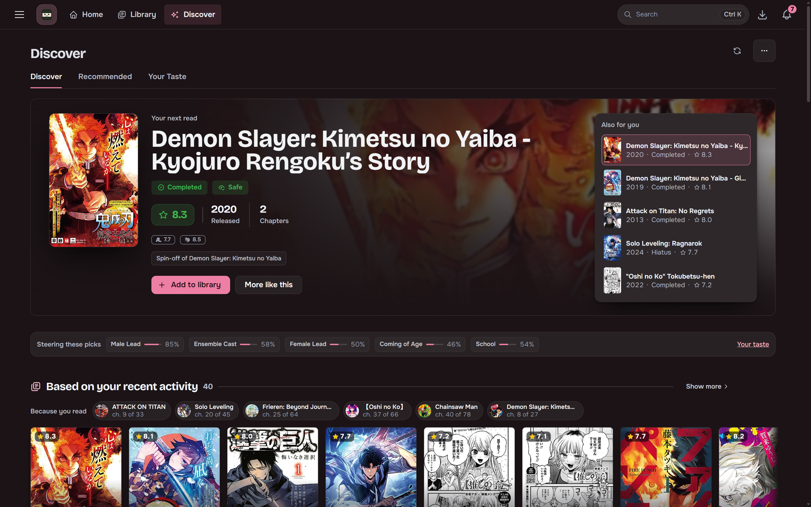
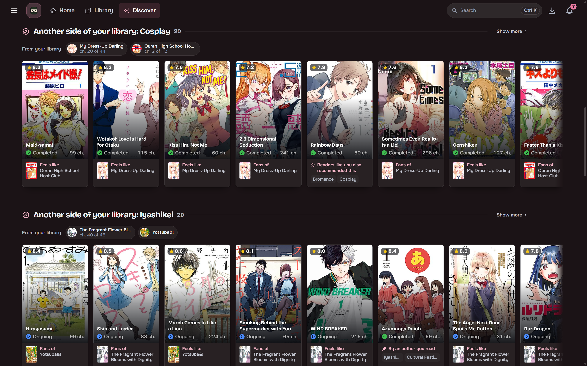
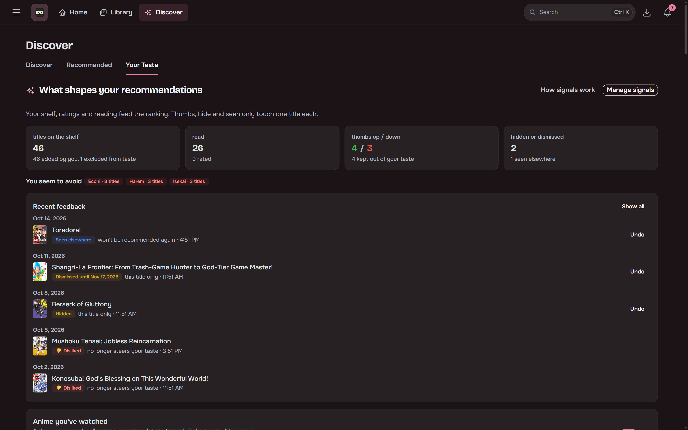
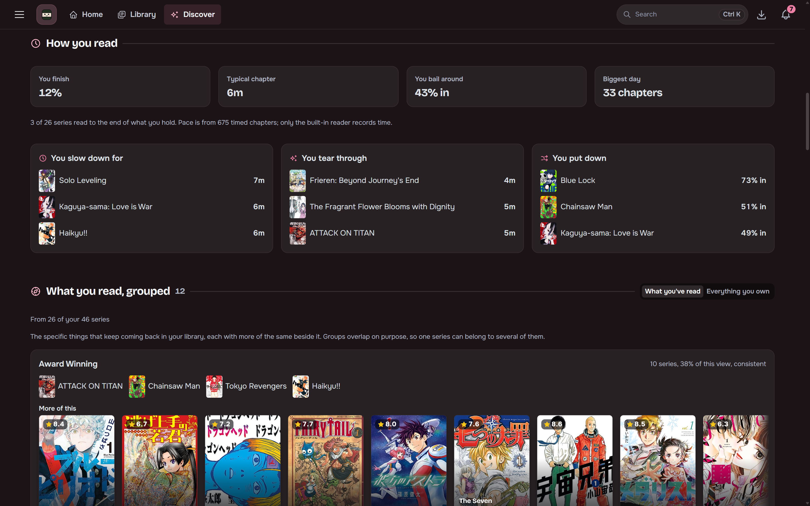

## Recommendations

Local ONNX embeddings over the MangaBaka dump find titles similar to your library. Seed them from
your whole library or from specific titles, and filter by year, rating, type, status, genre,
chapter count and content rating. A dial moves the picks from popular to obscure.

## Discover

Discover has four tabs:

- **Browse** has catalogue and genre rails, recent-reading picks, side interests and **Readers like
  you**.
- **Recommended** holds the seeded picks described above.
- **Your taste** shows reading behaviour, grouped interests, the tags steering your picks and how
  your taste has moved.
- **Shortlist** holds titles you saved for later.

Every card shows its rating top left, and titles already in your library carry a check mark top
right. Every rail has a fullscreen **Show more** view. Detail cards show categorized tags, alternate
titles, creators, per-source ratings and MyAnimeList reviews. Cards show the publication status as
a disc beside the year and chapter count. Detail cards also have thumbs up and thumbs down, and
after you mark a title seen, a toast offers **Liked it** and **Disliked it**. See
[Tune what you see](/Maki/guides/recommendations/feedback/).

## Shortlist

Save titles you might read later without adding them to the library. The series modal has a save
button, saved cards carry a ribbon, and the **Shortlist** tab lists them. Each entry can hold a note.

- Rows show what changed since you saved a title (completed, resumed, on hiatus, cancelled) and
  where you saved it from.
- Adding a title to the library takes it off the shortlist. Hiding it or giving it a thumbs down
  removes it too.
- Saving doesn't count as a taste signal for recommendations.
- Tracker [import lists](/Maki/guides/trackers/connect/#importing-your-lists) put **Plan to read**
  entries here.

## Metadata

One MangaBaka search identifies a series and brings along its MyAnimeList, AniList, MangaUpdates
and Kitsu IDs.

The local [MangaBaka dump](https://mangabaka.org/data/database) (nightly snapshot, about a 350 MB
download and 3.5 GB on disk) answers every metadata lookup, so search and library imports are
instant. A series MangaBaka added after the latest snapshot shows up with the next one.
MangaBaka-original data is [CC BY-NC-SA 4.0](https://creativecommons.org/licenses/by-nc-sa/4.0/).
